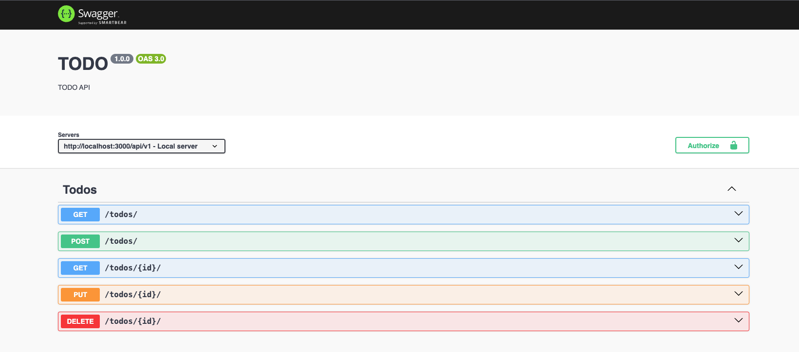
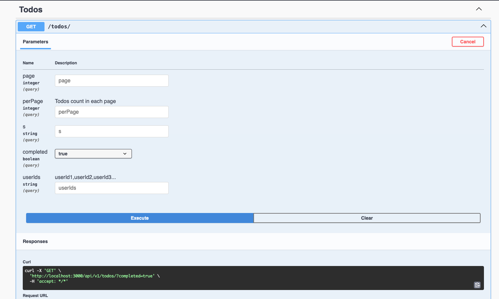

# Node.js Express Elasticsearch

This project is a Node.js Express application with Elasticsearch integration, featuring basic CRUD operations for both indices and documents.

## What's Included in This Repository

This project includes the following components:

- **Express API** with CRUD endpoints using **Elasticsearch** as the database
- **Elasticsearch client** for basic actions: CRUD operations for indices and documents

## Prerequisites

You will need the following tools:

- Node.js (along with npm)
- Elasticsearch

## Installation

Follow these steps to set up your development environment:

1. Clone the repository:

```
git clone https://github.com/grishahovhanyan/elasticsearch-node.git
```

2. Navigate to the project directory:

```
cd elasticsearch-node
```

3. Install the dependencies:

```
npm install
```

4. Ensure Elasticsearch is running on your machine or set up your connection in the `elasticsearch` client configuration.

## Running the Project

1. Start the Express server:

```
npm run start:dev
```

2. The server will be running at `http://localhost:3000`. The Swagger UI will be available at `http://localhost:3000/swagger-ui/`.

## API Endpoints

- **Get Todos:** `GET /todos/`
- **Create Todo:** `POST /todos/`
- **Get Todo by Id:** `GET /todos/:id/`
- **Update Todo by Id:** `PUT /todos/:id/`
- **Delete Todo by Id:** `DELETE /todos/:id/`




## Author

- **Grisha Hovhanyan** - [github:grishahovhanyan](https://github.com/grishahovhanyan)
